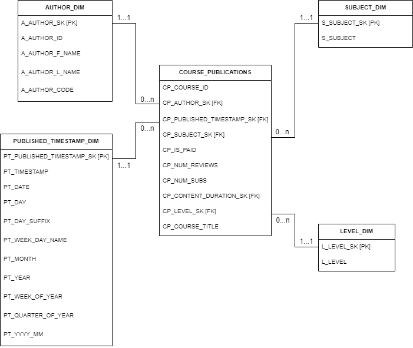

# w-trainer-pipeline

* Create a folder named logs in the base directory before start execution
* Install the required libraries from the requirements.txt file
```.shell script
pip install -r requirements.txt
``` 
* Queries used for the databases are included in the ```resources/database``` directory


#### Dimensional model for destination schema
 

